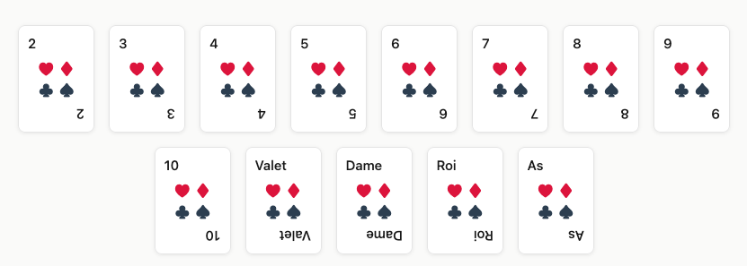

# Guess the card

Kata pour apprendre à remodeler un code legacy pour le rendre testable



## Installer les dépendances

```bash
npm install
```

## Lancer l'application en local

```bash
npm run dev
``` 

## Lancer les tests

```bash
npm run test
```